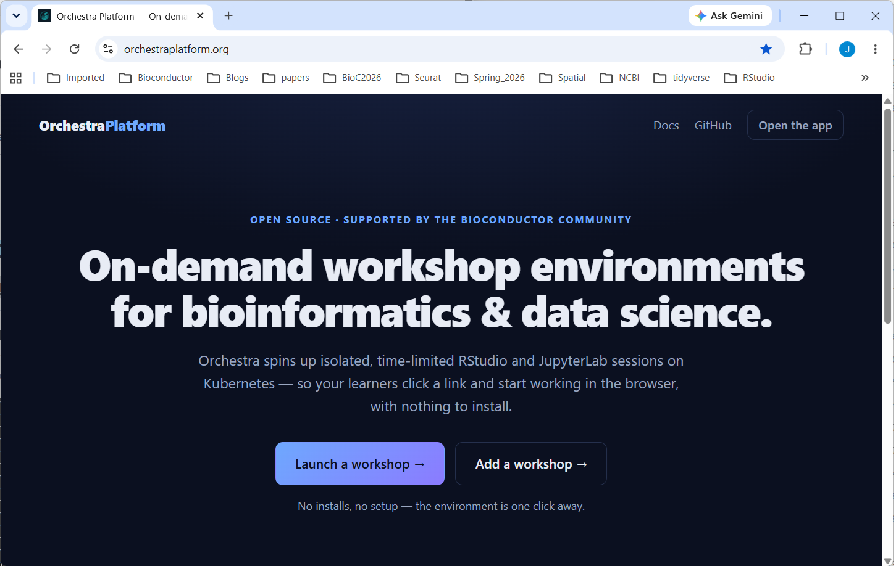
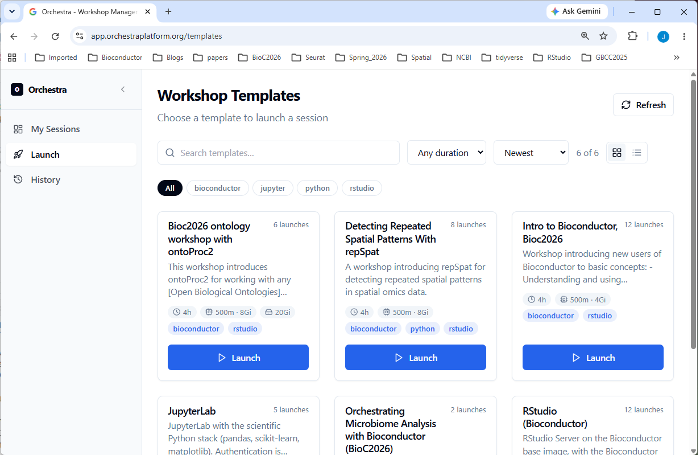
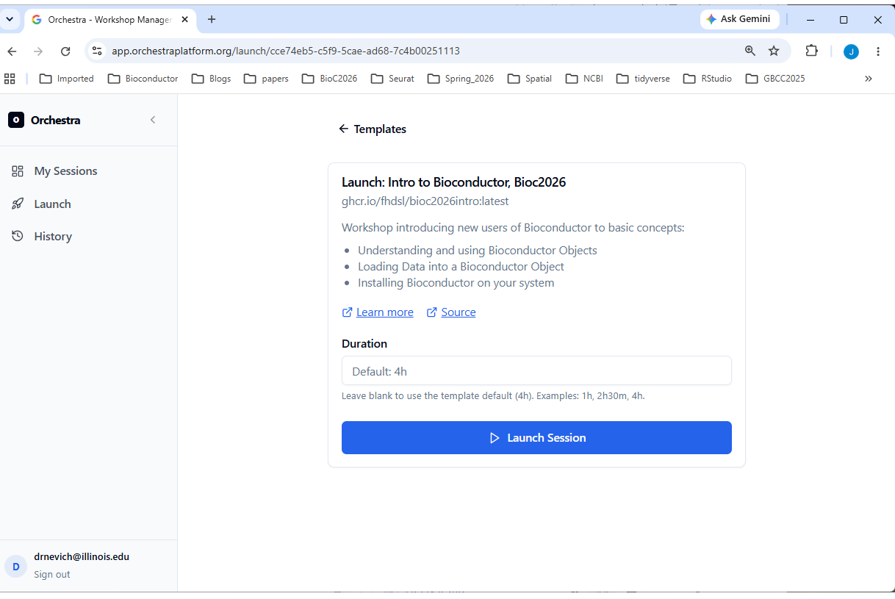
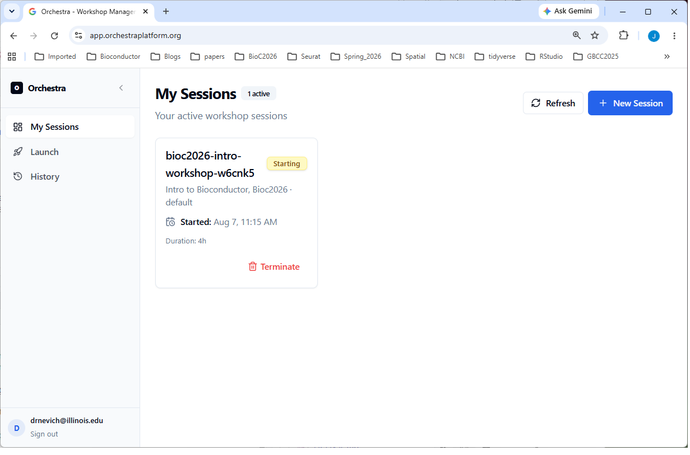
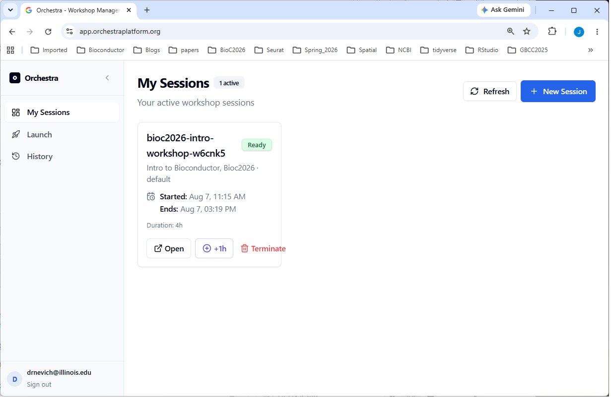
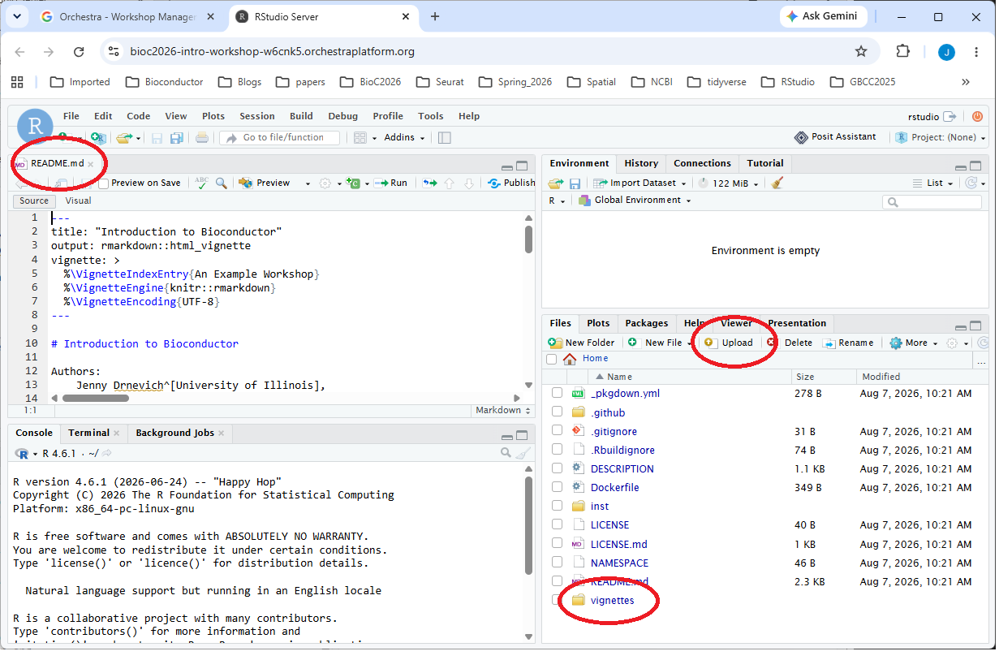
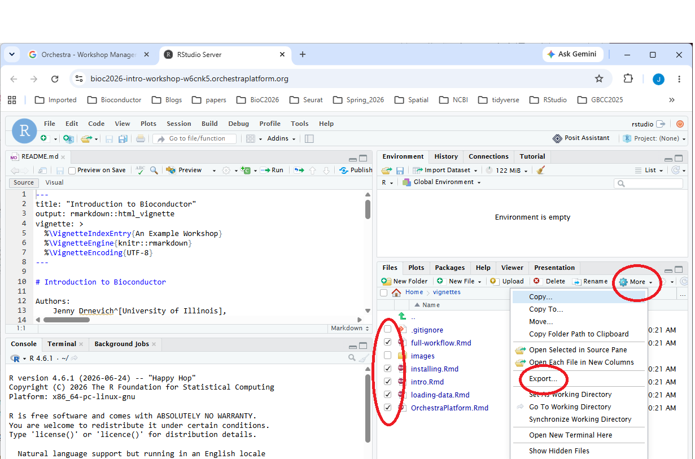
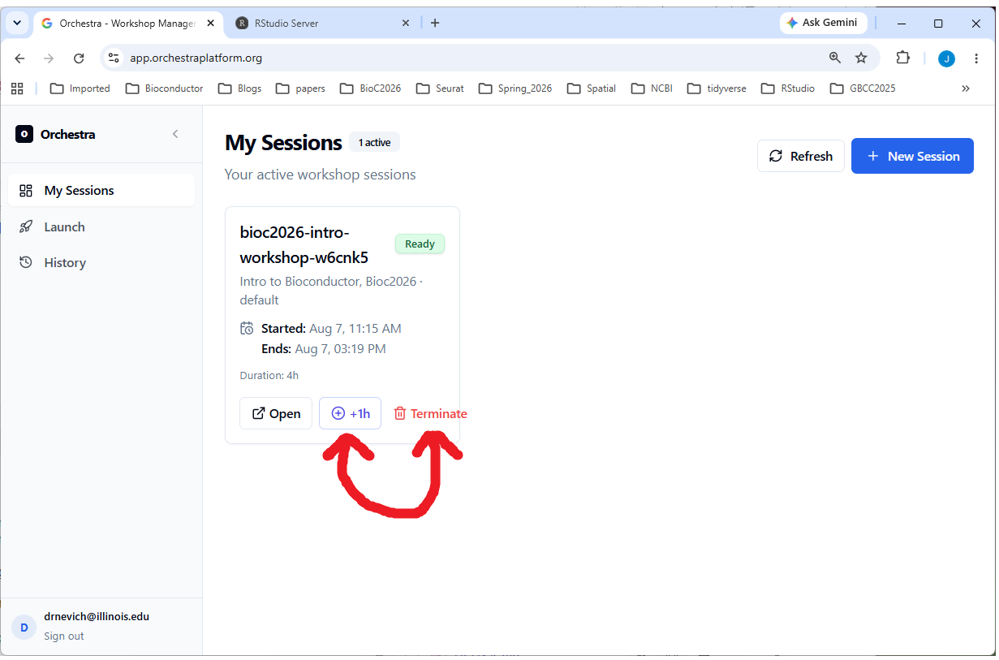

::: callout
## This page adapted from [Using a Workshop Session](https://orchestraplatform.org/docs/participant/using-a-session/)
:::

## Log in

We will use a pre-configured RStudio instance hosted on OrchestraPlatfom
for the hands-on part. Log in on any browser:

1.  **orchestraplatform.org** click on "Launch a workshop"

:::: columns
::: {.column width="75%"}

:::
::::

2.  Sign in with a Google account. Any Google account works — a personal
    Gmail address or an institutional account backed by Google.

3.  Click on "Launch" on left side (or + Browse Templates or + New
    Session) and pick the desired workshop (here: **Intro to
    Bioconductor, Bioc2026**)

:::: columns
::: {.column width="75%"}

:::
::::

4.  Select desired duration and click "Launch Session"

:::: columns
::: {.column width="75%"}

:::
::::

5.  You will see a **Session Card** with the status *Pending* then *Starting* as the instance gets spun up. It will stay on *Starting* for 30 sec - several minutes depending on usage.

:::: columns
::: {.column width="75%"}

:::
::::

6.  Once you see *Ready* choose Open to connect

:::: columns
::: {.column width="75%"}

:::
::::

7.  A new browser tab will open with RStudio and the materials for the
    workshop.
    - **README.md** is a good place to start
    - Articles/lessons are in the **vignettes** folder
    - Files can be uploaded by using the **Upload** button in the Files
      tab

:::: columns
::: {.column width="75%"}

:::
::::

## The session is temporary!

Every session has a time limit, shown as a countdown on its session card
in the first browser tab. This keeps the cluster available for everyone
— but it means:

::: callout
#### Save your work before the timer runs out.

When a session expires (or you end it), everything in it is removed —
including files you created. Download anything you want to keep —
notebooks, scripts, results — before it expires. There is no way to
recover a session after it’s gone.

To download files: in RStudio, tick the files in the Files pane, then
More → Export…;
:::

:::: columns
::: {.column width="75%"}

:::
::::

## Get more time

If you’re running low, use **+1h** on the session card in the first
browser tab to extend it. You’ll see a warning as the deadline
approaches, and again when it’s close.

## Finished early?

When you’re done, choose Terminate on the session card in the dashboard
to end the session and free up resources. If you’d rather not, that’s
fine too — just close the tab and the session will clean itself up when
the timer runs out. Either way, save your work first.

:::: columns
::: {.column width="75%"}

:::
::::

## Something went wrong?

- **Stuck on *Starting* for a while** — some images are large and take a
  few minutes on first launch. If it never reaches *Ready*, tell your
  instructor.

- **Session disappeared** — it likely expired. Launch a fresh one;
  remember to save your work this time.

- **Can’t open it** — your workshop may still be starting, or the
  session ended. Check the status on the dashboard.
