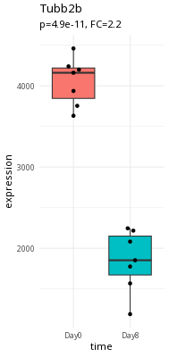
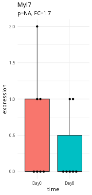

## Learning Objectives

- **Explain** the Bioconductor Project
- **Explain** the basic structure of Bioconductor S4 objects
- **Explain** and **Utilize** `SummarizedExperiment` objects using the
  `tidySummarizedExperiment` package

## What is Bioconductor?

- [An open-source software
  project](https://pubmed.ncbi.nlm.nih.gov/25633503/) since 2001 for
  'omics analyses
- [A
  repository](https://bioconductor.org/packages/release/BiocViews.html#___Software)
  of > 3,500 curated, inter-operable R packages
- A community of developers and users
  - [Support site](https://support.bioconductor.org/)
  - [Developer mailing list](https://stat.ethz.ch/mailman/listinfo/bioc-devel)
  - [Zulip
    chat](https://community-bioc.zulipchat.com/join/4k2tpsy7h6zjbaduydwm2n56/)
  - [YouTube channel](https://www.youtube.com/user/bioconductor)
  - Annual conferences in [North
    America](https://bioc2026.bioconductor.org/),
    [Europe](https://eurobioc2026.bioconductor.org/) and
    [Asia](https://biocasia2026.bioconductor.org/)
  - [Working groups](https://workinggroups.bioconductor.org/)

Data in bioinformatics is often complex and doesn't fit into a single
data frame.\
To deal with this, developers define specialized data containers (termed
*classes*) that match the properties of the data they need to handle.

This aspect is central to the **Bioconductor**[^1] project which uses
the same **core data infrastructure** across packages. This certainly
contributed to Bioconductor's success. Bioconductor package developers
are advised to make use of existing infrastructure to provide coherence,
interoperability, and stability to the project as a whole.

[^1]: The [Bioconductor](https://www.bioconductor.org) project was
    initiated by Robert Gentleman, one of the two creators of the R
    language. Bioconductor provides tools dedicated to omics data
    analysis. Bioconductor uses the R statistical programming language
    and is open source and open development.

## S4 Bioconductor Objects

At the heart of Bioconductor are the [S4
Objects](https://bioconductor.org/help/course-materials/2017/Zurich/S4-classes-and-methods.html).
You can think of these data structures as ways to package together:

- **Assay Data**, such as an RNAseq count matrix
- **Metadata** (data about the experiment), including Experimental
  Design

Part of why Bioconductor works is this data packaging. We can write
functions to act on the data in these S4 Objects as part of a processing
*workflow*. As long as we output a Bioconductor S4 object, our routines
can work as part of a pipeline. These routines are called `methods()`,
and may come from a variety of packages.

::: callout
#### What is a method?

You may have heard of *functions* and *methods* - what is the
difference?

A working definition of a method is that it is a function that works on
a particular object type, such as the `SummarizedExperiment` type we're
going to investigate in a little bit.

*Method* is a little bit more specific than a *function*.
:::

You can think of the Bioconductor S4 objects as taking the place of
`data.frame`s in `dplyr` pipelines - they are the common format that all
of the Bioconductor methods work on. They allow Bioconductor methods to
be interoperable - we can mix and match methods from various packages to
customize our analysis.

## Case Study: RNAseq Experiments

Bulk RNAseq experiments are meant to distinguish expression differences
between samples or groups of samples.

[Please see the concepts
section](https://bioconductor-genomics.netlify.app/00_concepts.html) for
more in depth details of the processing of RNA-seq experiments.

::::: columns
::: {.column width="50%"}
Here is an example of a large expression difference (Tubb2a).


:::

::: {.column width="50%"}
Here is an example of a questionable expression difference (myl7).


:::
:::::

Take a second and think about what makes Tubb2a a better candidate than
myl7.

## What are we trying to accomplish?

In RNAseq, we are interested in assessing *expression differences*
between samples at either the gene or transcript level. The starting
data for this is typically a matrix of counts for thousands of genes and
many samples.

In order to do see if there are expression differences, we need
*phenotype information* about the samples in our experiment.
Specifically, we need to have information about:

- conditions (infection, time)
- possible confounders (gender)

## Experimental Design of RNAseq Experiments

When we design our RNAseq experiment, we want to be able to:

- Number and type of **replicates**
- Avoiding **confounding**
- Addressing **batch effects**

The important thing to note is that if you're unsure about the
experimental design, *contact your Bioinformatics Core*. They can help
you design the experiment based on what samples you have.

[Please see the experimental design
section](https://bioconductor-genomics.netlify.app/02_week2.html) for
more in depth details.

## `SummarizedExperiment`

One of the most used Bioconductor S4 objects is the
`SummarizedExperiment`, which was developed to hold any kind of data
from features (e.g., genes, proteins, metabolites) measured across many
samples, and also metadata about the features and samples. The following
diagram shows how the different *data slots* in the
`SummarizedExperiment` relate to each other.


We'll take a look at data in a `SummarizedExperiment` object:

```{r}
#| warning: false
#| message: false
library(SummarizedExperiment)

SE <- readRDS(system.file("extdata/GSE96870_se.rds", package="bioc2026Intro"))
SE
```

### Validation

The other big part of S4 objects is *validation*. This can be a bit hard
to wrap your head around.

The Bioconductor designers put special validation checks on the input
data for the Bioconductor objects when you load data into them.

The following is what is called the *Constructor* for the
`SummarizedExperiment` object. This is what we use to make a brand new
`SummarizedExperiment` object from its pieces.

``` r
SummarizedExperiment(assays=SimpleList(),
                     rowData=NULL, rowRanges=NULL,
                     colData=DataFrame(),
                     metadata=list(),
                     checkDimnames=TRUE)
```

Each argument to the `SummarizedExperiment` constructor defines
restrictions on that slot. For example, there is a slot called `assays`.

The `checkDimnames` argument is critical. In order to do any work with
an experiment you need to map samples to `colNames` (the experimental
matrix). For example, to calculate differential expression between
samples, you need to specify the different groups to compare and which
samples map to which groups. Thus, the column names in the AssayData
must be identical to the row names in `colData`.

::: callout
#### If it isn't in `colData`, it doesn't exist

Keep in mind that your `colData` must be as complete as possible. Why?
The short answer is that if there isn't a row for your sample in
`colData`, then it basically doesn't exist for Bioconductor methods.

So make sure your `colData` contains sample names for all your samples.
:::

In some ways, the `SummarizedExperiment` object is like a `data.frame`,
but with extra metadata. For example, our object has column names, which
correspond to sample identifiers:

```{r}
colnames(SE)
```

And row names:

```{r}
rownames(SE)[1:30]
```

So far, so good.

## Assay Data

Everything in `SummarizedExperiment` is built around the Assay data that
we store in it.

Each element of the Assay data list contains a `matrix` with the
following contents:

- **Rows**: correspond to Gene Locus or possibly Transcripts
- **Columns**: correspond to the samples used in your experiment.
- **Values**: correspond to the actual data. In the case of RNAseq,
  these are the *counts* that map to each row.

You can extract the assay data using the `assay()` method:

```{r}
assay_data <- assay(SE)
head(assay_data)
```

::: callout
## Assays Are Not just for RNAseq data

Assay Data is very flexible. For example, there are flow cytometry
objects where the rows correspond to cell surface markers, and columns
that correspond to each cell. Similarly, `SingleCellExperiment` objects
(which are derived from `SummarizedExperiment`) have rows that
correspond to Genes and columns that correspond to individual cells.
:::

### Think about it

Are the colnames of our object identical to the colnames of the assay
object? Try it out:

```{r}
colnames(SE)
colnames(assay(SE))
```

## Metadata

Metadata is information about the experiment that is not part of the
Assay Data.

The most important part of the metadata is the `colData` slot. This slot
contains information about the samples (the columns) of the assay. This
is where we store the Experimental Design that we talked about.

```{r}
colData(SE)
```

In our experimental design, we have males and females, timepoints, and
different kinds of tissues.

### Think about it

What do the `rownames()` of `colData(SE)` correspond to?

```{r}
rownames(colData(SE))
```

::: callout-note
## Keep your `SummarizedExperiment` whole

It might be tempting to extract the assay data and the metadata and work
with them separately. But as we'll see in the following section, these
two slots work together and enable all sorts of analysis.
:::

## Subsetting `SummarizedExperiment`

We saw that we have the `checkNames` constraint. This is because we can
use the `colData` and the `assayData` in our object to do subsetting
using the metadata.

```{r}
female <- SE[,SE$sex == "Female"]
female
colData(female)
```

This tight interaction of metadata and assay data is critical when we
start doing differential analysis. The experimental design will help
determine whether we can make the comparisons we want to make and the
conclusions we can draw from the dataset.

::: callout
#### Remember the Comma

Remember that the `,` (comma) is used to distinguish between rows and
columns. Rows correspond to *genes* and columns correpsond to *samples*.

In the above example, we are subsetting the samples, so our criteria
goes after the comma.
:::


This is the base R way of subsetting the `SummarizedExperiment` object. In a later section, we will learn how to use the
`tidySummarizedExperiment` package to subset/manipulate/plot it the tidyverse way - essentially this
package lets us use `dplyr` on the `SummarizedExperiment` and
`DESeqDataset` objects.

### Try it out

Try subsetting `SE` to have `time == "Day0"`. How many samples are left?

```{r}
#| eval: false
day0 <- SE[,SE$----- == -------]
day0
colData(day0)
```

## rowData: Additional Annotations

```{r}
rowData(SE)
```

## rowRanges: Genomic Information

The `SummarizedExperiment` we are working with is actually a variant: a
`RangedSummarizedExperiment`. It contains an additional slot called
`rowRanges`. The `rowRanges` slot of a `SummarizedExperiment` can
contain genomic information, such as genomic coordinates. Let's take a
look:

```{r}
rowRanges(SE)
```

The `seqnames` column corresponds to the chromosome, `ranges` is what is
called an `IRanges` object, which specifies an interval defined by a
start and end coordinate, and a `strand`.

## Filtering by Genomic Ranges

The `SummarizedExperiment` we are working with is actually a variant: a
`RangedSummarizedExperiment`. This allows you to subset the rows by
genomic intervals.

Our main technique for subsetting by i is `subsetByOverlaps()`. We'll
need to define a Genomic Region of Interest (ROI), and then we can
subset our `SE` object with that ROI.

Our ROI is defined by a `GRanges` object, which can specify a range of
genomic coordinates. Remember that the `seqnames` column corresponds to
chromosome, and the `ranges` column needs to be defined as an
`IRanges()` object, with a `start` and `end`.

```{r}
roi <- GRanges(seqnames = "1", ranges=IRanges(start = 1, end = 5000000))
subset_SE <- subsetByOverlaps(SE, roi) 
subset_SE
```

You can see we have 19 rows left in `subset_SE` that map to our Genomic
Range of interest.

If you have more than 1 region of interest, you can combine multiple
sets of ranges into your `GRanges` object for subsetting.

::: callout-note
## A Common Bioconductor Pattern

Depending on the package, we will tend to *overwrite* objects as we run
methods on them, such as the following.

In `DESeq2`, each method will add something to the object (usually extra
columns or a results table).

Here's an example:

```{r}
#| eval: false
library(SummarizedExperiment)
library(DESeq2)

DSE <- DESeqDataSet(SE, design = ~ sex + time)  #make DESeqDataset
DSE <- DSE[rowSums(assay(DSE)) > 5,] #filter out low expressing candidates
DSE <- DESeq(DSE) #run estimateSizeFactors, estimateDispersions, nbinomialWaldTest
```
:::

## `tidySummarizedExperiment`

The `SummarizedExperiment` object does not act like the normal
`data.frame`/`tibble` we expect, especially in filtering and subsetting.

The `tidySummarizedExperiment` package will be helpful for us to
understand and visualize the `SummarizedExperiment` package. Once we do
that, our `SummarizedExperiment` object will act more like a
`data.frame`.

Basically, `tidySummarizedExperiment` treats the data as a long data
frame that combines both the assay and metadata. This format is helpful
in doing more work with the `tidyverse`:

```{r}
library(tidySummarizedExperiment)
SE
```

### Filtering Data

We can use `dplyr` to filter the data using the
`tidySummarizedExperiment` package:

```{r}
SE |>
  filter(sex == "Female")
```

### Getting Counts across the experiment

We can produce summaries of the counts of each sample library:

```{r}
SE |>
    group_by(.sample) |>
    summarise(total_counts=sum(counts))
```

### Try it out

Try summarizing the `total_counts` by `sex` or by `infection`:

```{r}
SE |>
  group_by(sex) |>
  summarize(total_counts = sum(counts))
```

### Plotting

We can look at the distribution of counts across samples by using
`.sample` as our grouping variable in `ggplot()`.

```{r tidySE-plot}
SE |>
    ggplot(aes(counts + 1, group=.sample, color=infection)) +
    geom_density() +
    scale_x_log10() +
    theme_bw()
```

Our data (individual gene counts) is highly skewed. If we log-transform
the data, then the skew is lessened. The boxplots of log counts are
helpful for detecting batch effects.

```{r tidy-boxplot}
SE |>
    ggplot(aes(y=log2(counts + 1), group=.sample, fill=infection)) +
    geom_boxplot() +
    theme_bw()
```

Take a look at the above box plot. Are there differences in distribution
between samples?

In order to compare expression levels between samples, we will need to
adjust, or *normalize* by library size. We'll investigate this further
when we get to differential expression.

### Try it Out

Try mapping another variable to `fill`.

```{r tidy-boxplot2}
#| eval: false
SE |>
    ggplot(aes(y=log2(counts + 1), group=.sample, fill=sex)) +
    geom_boxplot() +
    theme_bw()
```

## Take Home Messages

- We package multiple parts of the data (assay data and metadata) into a
  `SummarizedExperiment` object:
  - **Columns** correspond to *samples*, **Rows** correspond to *gene
    locus* or *transcripts*
  - *Column names* of the assay data must match a column in the
    `colData`
  - *Experimental Design* variables are part of the `colData`
  - Rownames of the assay data must match the rowNames in the column
    data
- The `SummarizedExperiment` object lets us subset by phenotype
  variables
- `tidySummarizedExperiment` lets us interact with the
  `SummarizedExperiment` object as if it were a long data frame with
  both metadata and assay data together.
  - We can plot and subset the `SummarizedExperiment` object using our
    regular `tidyverse` tools (`ggplot2`, `dplyr`, etc.) once we load
    the `tidySummarizedExperiment` package.

::: callout-note
#### What about all of the other kinds of objects?

Most of the other Bioconductor Data Structures derive from some variant
of the `SummarizedExperiment`, or are utilized by `SummarizedExperiment`, such as `GenomicRanges`. They might add some functionality that is
core to the package they belong to, such as `DEseq2`. This includes
`seurat` objects for Single Cell sequencing.

Please see the Installing vignette for more information.
:::
